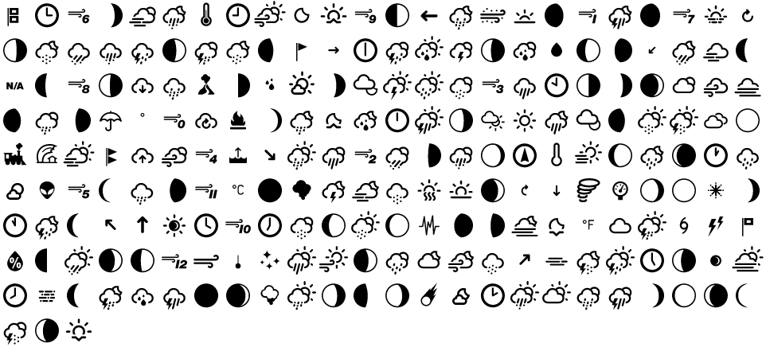

# react-weather-icons

> A React component library for [weather icons](https://github.com/erikflowers/weather-icons) by [@erikflowers](https://github.com/erikflowers).

[](https://www.npmjs.com/package/@intern0t/react-weather-icons) [](https://standardjs.com) [](https://travis-ci.com/intern0t/react-weather-icons)



> View more color play [Samples & Color play](/Samples.md), reference Icon components [here](https://intern0t.github.io/react-weather-icons/).

---

## Install

```bash
npm i @intern0t/react-weather-icons --save
```

## Import

```jsx
import * as Icons from "@intern0t/react-weather-icons";
```

```jsx
import { NightCloudyGusts } from "@intern0t/react-weather-icons";
```

## Usage

```jsx
<Icons.NightCloudyGusts color="#000" size={30} />
```

```jsx
<NightCloudyGusts color="#000" size={30} />
```

The `size` defaults to `30` if no `size` arguments are provided, and `color` defaults to `#000000`.

---

## Automation for weather information fetching

All the icons are capitalized and trimmed of all non-alphanumeric characters; hence, you may reverse the process to associate the response from various weather APIs to the icons in this library.

To associate the icons to the response from various weather API providers such as **Open Weather Map**, **World Meteorological Organization**, **Weather Underground**, **Forecast.io**, and **Yahoo**. First, you need to have a specific [reference list](https://erikflowers.github.io/weather-icons/api-list.html) implemented to your application.

Then, replace `-` in the associated value with space (`) and capitalize all the words, then replace the spaces (`) with nothing `""`. This ends up generating a variable associated with the icon which you can use.

### Example

If the request to Open Weather Map's API returned icon id of `310` (`wi-owm-day-310`), then the value associated would be `day-rain`, replace all the `-` with `` to have `day rain` and capitalize all the words in the string. In `Day Rain`, replace all the spaces with nothing `""` to achieve `DayRain`, which is an icon name.

---

## Acknowledgments

-   SVG [weather icons](https://github.com/erikflowers/weather-icons) by [@erikflowers](https://github.com/erikflowers).
-   [Prettier CLI](https://prettier.io/docs/en/cli.html) for helping me mass prettify `.js` files.
-   Github & Github Pages.
-   [NPM](https://www.npmjs.com/package/@intern0t/react-weather-icons)

## License

GPL © [intern0t](https://github.com/intern0t)
